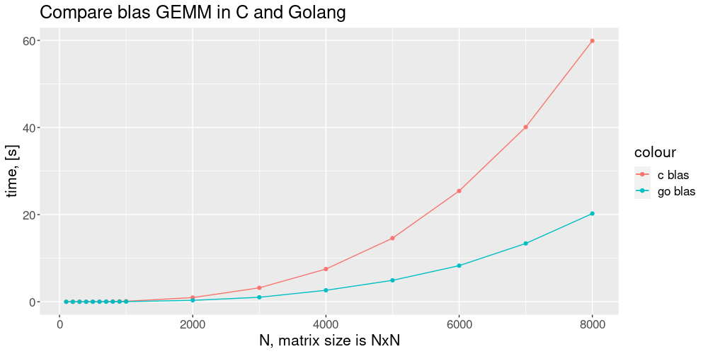

# benchmarks
Benchmarks between defferent packages or languages 

## http `hello world`

Here are shown the benchmarks results of a simple http server which returns only `hello world` to the request.
All tests was made on one machine. For detailed information see [Appendix](#appendix).

| Framework        | RPC              | Remark          |
|------------------|------------------|-----------------|
| Golang net/http  | 61692            |                 |
| nginx 1.18.0     | 53590            | Easy start.     |
| C++ userver [repo](https://github.com/userver-framework/userver) | 53483 | From Yandex. |
| Golang fasthttp  | 51947            | Not such fast how do you think.    |
| Golang gin-gonic | 50970            | Not great not terrible             |
| node v18.18.0 turbo-http | 42984 |                                       |
| node v18.18.0 express    | 9100  |                                       |
| node v18.18.0 http       | 6065  |                                       |
| tornado 6.4.1            | 4116  | The result in single thread mode.     |
| python http.server       | 3265  | Didn't handle all requests.           |
| C++ httplib [repo](https://github.com/yhirose/cpp-httplib)       | 406   | **Very simple library.** **This library uses 'blocking' socket I/O.** |


## BLAS GEMM
The comparison results of simple matrix multiplication with [blas](https://www.netlib.org/blas/) library in Golang and C are presented on the graph.  Source code are in folders `goblas` and `cblas`.



This performance gap is due to [dgemmParallel](https://github.com/gonum/gonum/blob/master/blas/gonum/dgemm.go#L124) parallelism.

### Appendix

Processor: AMD® Ryzen 5 4600h with radeon graphics × 12

Benchmark command
```bash
ab -c 1000 -n 100000 -k http://localhost:8080/hello
```

```bash
# Golang net/http
#############################################

Server Software:        
Server Hostname:        localhost
Server Port:            8090

Document Path:          /hello
Document Length:        12 bytes

Concurrency Level:      1000
Time taken for tests:   1.621 seconds
Complete requests:      100000
Failed requests:        0
Keep-Alive requests:    100000
Total transferred:      15300000 bytes
HTML transferred:       1200000 bytes
Requests per second:    61692.03 [#/sec] (mean)
Time per request:       16.210 [ms] (mean)
Time per request:       0.016 [ms] (mean, across all concurrent requests)
Transfer rate:          9217.66 [Kbytes/sec] received

Connection Times (ms)
              min  mean[+/-sd] median   max
Connect:        0    0   3.1      0      49
Processing:     7   16   0.8     16      49
Waiting:        0   16   0.8     16      19
Total:          7   16   3.3     16      64

Percentage of the requests served within a certain time (ms)
  50%     16
  66%     16
  75%     16
  80%     16
  90%     16
  95%     16
  98%     17
  99%     35
 100%     64 (longest request)
```


```bash
# nginx 1.18
erver Software:        nginx/1.18.0
Server Hostname:        localhost
Server Port:            80

Document Path:          /hello
Document Length:        14 bytes

Concurrency Level:      1000
Time taken for tests:   1.866 seconds
Complete requests:      100000
Failed requests:        0
Keep-Alive requests:    99538
Total transferred:      21097690 bytes
HTML transferred:       1400000 bytes
Requests per second:    53590.40 [#/sec] (mean)
Time per request:       18.660 [ms] (mean)
Time per request:       0.019 [ms] (mean, across all concurrent requests)
Transfer rate:          11041.34 [Kbytes/sec] received

Connection Times (ms)
              min  mean[+/-sd] median   max
Connect:        0    0   3.9      0      68
Processing:     0   18   2.5     18      68
Waiting:        0   18   2.6     18      35
Total:          0   18   4.8     18      86

Percentage of the requests served within a certain time (ms)
  50%     18
  66%     18
  75%     18
  80%     18
  90%     19
  95%     19
  98%     30
  99%     40
 100%     86 (longest request)
```


```bash
# C++ userver
#############################################
Server Software:        userver/1.0.0
Server Hostname:        localhost
Server Port:            8080

Document Path:          /hello
Document Length:        13 bytes

Concurrency Level:      1000
Time taken for tests:   1.870 seconds
Complete requests:      100000
Failed requests:        0
Keep-Alive requests:    100000
Total transferred:      36600000 bytes
HTML transferred:       1300000 bytes
Requests per second:    53483.03 [#/sec] (mean)
Time per request:       18.698 [ms] (mean)
Time per request:       0.019 [ms] (mean, across all concurrent requests)
Transfer rate:          19116.00 [Kbytes/sec] received

Connection Times (ms)
              min  mean[+/-sd] median   max
Connect:        0    0   3.3      0      55
Processing:     6   18   1.4     18      55
Waiting:        1   18   1.4     18      40
Total:          6   18   4.0     18      91

Percentage of the requests served within a certain time (ms)
  50%     18
  66%     18
  75%     18
  80%     18
  90%     18
  95%     18
  98%     19
  99%     29
 100%     91 (longest request)
```

C++ show enough good results, but for a `simple` http server golang seems is a little bit faster.

```bash
# Golang fasthttp
#############################################
Server Software:        fasthttp
Server Hostname:        localhost
Server Port:            8080

Document Path:          /hello
Document Length:        15 bytes

Concurrency Level:      1000
Time taken for tests:   1.925 seconds
Complete requests:      100000
Failed requests:        0
Keep-Alive requests:    100000
Total transferred:      17400000 bytes
HTML transferred:       1500000 bytes
Requests per second:    51947.03 [#/sec] (mean)
Time per request:       19.250 [ms] (mean)
Time per request:       0.019 [ms] (mean, across all concurrent requests)
Transfer rate:          8826.94 [Kbytes/sec] received

Connection Times (ms)
              min  mean[+/-sd] median   max
Connect:        0    0   3.8      0      64
Processing:     8   18   0.9     18      64
Waiting:        0   18   0.8     18      38
Total:          8   19   3.9     18      83

Percentage of the requests served within a certain time (ms)
  50%     18
  66%     19
  75%     19
  80%     19
  90%     19
  95%     19
  98%     20
  99%     39
 100%     83 (longest request)
```

```bash
# Golang gin-gonic
#############################################
Server Software:        
Server Hostname:        localhost
Server Port:            8080

Document Path:          /hello
Document Length:        31 bytes

Concurrency Level:      1000
Time taken for tests:   1.962 seconds
Complete requests:      100000
Failed requests:        0
Keep-Alive requests:    100000
Total transferred:      17200000 bytes
HTML transferred:       3100000 bytes
Requests per second:    50970.27 [#/sec] (mean)
Time per request:       19.619 [ms] (mean)
Time per request:       0.020 [ms] (mean, across all concurrent requests)
Transfer rate:          8561.41 [Kbytes/sec] received

Connection Times (ms)
              min  mean[+/-sd] median   max
Connect:        0    0   4.1      0      70
Processing:     8   19   1.1     19      70
Waiting:        0   19   1.1     19      23
Total:          8   19   4.5     19      91

Percentage of the requests served within a certain time (ms)
  50%     19
  66%     19
  75%     19
  80%     19
  90%     20
  95%     21
  98%     21
  99%     45
 100%     91 (longest request)
```

```bash
# node v18.18.0 turbo-http
#############################################
Server Software:        
Server Hostname:        127.0.0.1
Server Port:            8080

Document Path:          /hello
Document Length:        18 bytes

Concurrency Level:      1000
Time taken for tests:   2.326 seconds
Complete requests:      100000
Failed requests:        0
Keep-Alive requests:    100000
Total transferred:      8900000 bytes
HTML transferred:       1800000 bytes
Requests per second:    42984.04 [#/sec] (mean)
Time per request:       23.264 [ms] (mean)
Time per request:       0.023 [ms] (mean, across all concurrent requests)
Transfer rate:          3735.92 [Kbytes/sec] received

Connection Times (ms)
              min  mean[+/-sd] median   max
Connect:        0    0   3.4      0      63
Processing:    10   22   2.2     22      63
Waiting:        0   22   2.1     22      47
Total:         10   23   4.1     22      82

Percentage of the requests served within a certain time (ms)
  50%     22
  66%     23
  75%     23
  80%     24
  90%     24
  95%     26
  98%     31
  99%     50
 100%     82 (longest request)
```

```bash
# node v18.18.0 express
#############################################
Server Software:        
Server Hostname:        localhost
Server Port:            8080

Document Path:          /hello
Document Length:        144 bytes

Concurrency Level:      1000
Time taken for tests:   10.988 seconds
Complete requests:      100000
Failed requests:        0
Non-2xx responses:      100000
Keep-Alive requests:    100000
Total transferred:      41600000 bytes
HTML transferred:       14400000 bytes
Requests per second:    9100.57 [#/sec] (mean)
Time per request:       109.883 [ms] (mean)
Time per request:       0.110 [ms] (mean, across all concurrent requests)
Transfer rate:          3697.11 [Kbytes/sec] received

Connection Times (ms)
              min  mean[+/-sd] median   max
Connect:        0    1  13.6      0    1026
Processing:    17  108 682.5     60   10867
Waiting:        7  108 682.5     60   10867
Total:         18  108 686.5     60   10914

Percentage of the requests served within a certain time (ms)
  50%     60
  66%     63
  75%     64
  80%     66
  90%     71
  95%     77
  98%     92
  99%    104
 100%  10914 (longest request)

```

```bash
# node v18.18.0 http
# was used -r key in ab command
# ab -c 1000 -n 100000 -rk http://127.0.0.1:8080/hello
#############################################
Server Software:        
Server Hostname:        127.0.0.1
Server Port:            8080

Document Path:          /hello
Document Length:        11 bytes

Concurrency Level:      1000
Time taken for tests:   16.487 seconds
Complete requests:      100000
Failed requests:        0
Keep-Alive requests:    0
Total transferred:      11200000 bytes
HTML transferred:       1100000 bytes
Requests per second:    6065.33 [#/sec] (mean)
Time per request:       164.872 [ms] (mean)
Time per request:       0.165 [ms] (mean, across all concurrent requests)
Transfer rate:          663.39 [Kbytes/sec] received

Connection Times (ms)
              min  mean[+/-sd] median   max
Connect:        0    8 177.7      0    7296
Processing:    20   69 271.6     61   13508
Waiting:        1   69 271.6     61   13507
Total:         50   77 389.4     61   16361

Percentage of the requests served within a certain time (ms)
  50%     61
  66%     61
  75%     62
  80%     62
  90%     65
  95%     67
  98%     70
  99%     91
 100%  16361 (longest request)
```

```bash
# tornado 6.4
############################################

Server Software:        TornadoServer/6.4.1
Server Hostname:        localhost
Server Port:            8080

Document Path:          /hello
Document Length:        13 bytes

Concurrency Level:      1000
Time taken for tests:   24.294 seconds
Complete requests:      100000
Failed requests:        0
Keep-Alive requests:    100000
Total transferred:      23200000 bytes
HTML transferred:       1300000 bytes
Requests per second:    4116.24 [#/sec] (mean)
Time per request:       242.940 [ms] (mean)
Time per request:       0.243 [ms] (mean, across all concurrent requests)
Transfer rate:          932.59 [Kbytes/sec] received

Connection Times (ms)
              min  mean[+/-sd] median   max
Connect:        0    2  39.6      0    1070
Processing:    26  240  47.4    217     555
Waiting:        1  240  47.4    217     555
Total:         26  242  66.0    217    1624

Percentage of the requests served within a certain time (ms)
  50%    217
  66%    241
  75%    248
  80%    254
  90%    322
  95%    347
  98%    377
  99%    389
 100%   1624 (longest request)

```

```bash
# python http.server
#############################################
Server Software:        SimpleHTTP/0.6
Server Hostname:        localhost
Server Port:            8080

Document Path:          /hello
Document Length:        12 bytes

Concurrency Level:      1000
Time taken for tests:   30.351 seconds
Complete requests:      99124
Failed requests:        3
   (Connect: 0, Receive: 1, Length: 1, Exceptions: 1)
Keep-Alive requests:    0
Total transferred:      13084236 bytes
HTML transferred:       1189476 bytes
Requests per second:    3265.91 [#/sec] (mean)
Time per request:       306.194 [ms] (mean)
Time per request:       0.306 [ms] (mean, across all concurrent requests)
Transfer rate:          420.99 [Kbytes/sec] received

Connection Times (ms)
              min  mean[+/-sd] median   max
Connect:        0    9 180.4      0   11236
Processing:     0    7 179.6      1   15157
Waiting:        0    7 173.1      1   15157
Total:          0   16 288.5      1   16201

Percentage of the requests served within a certain time (ms)
  50%      1
  66%      1
  75%      1
  80%      1
  90%      1
  95%      1
  98%      1
  99%      2
 100%  16201 (longest request)

```

```bash
# C++ httplib
#############################################
Server Software:        
Server Hostname:        localhost
Server Port:            8080

Document Path:          /hello
Document Length:        13 bytes

Concurrency Level:      1000
Time taken for tests:   30.007 seconds
Complete requests:      12197
Failed requests:        0
Keep-Alive requests:    9761
Total transferred:      1291430 bytes
HTML transferred:       158561 bytes
Requests per second:    406.47 [#/sec] (mean)
Time per request:       2460.233 [ms] (mean)
Time per request:       2.460 [ms] (mean, across all concurrent requests)
Transfer rate:          42.03 [Kbytes/sec] received

Connection Times (ms)
              min  mean[+/-sd] median   max
Connect:        0    3   9.0      0      52
Processing:     0 1964 4203.1     44   12208
Waiting:        0 1937 4215.3      0   12208
Total:          0 1966 4204.8     44   12208

Percentage of the requests served within a certain time (ms)
  50%     44
  66%     47
  75%     48
  80%     65
  90%  12116
  95%  12147
  98%  12168
  99%  12176
 100%  12208 (longest request)
```
